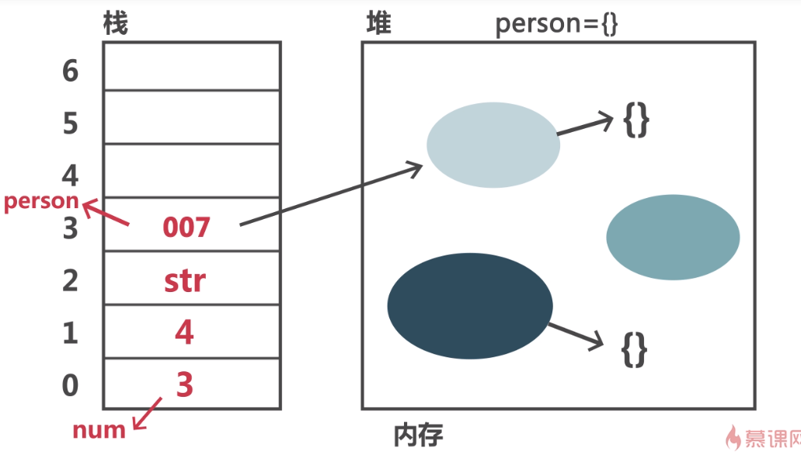

### 1. 基本类型和引用类型

#### 区别：基本类型不可修改

#### 1) 基本类型：Number, String, true/false, undefined, null, 按值访问

#### 2) 引用类型：引用类型的最底层的值一般是由基本类型构成, 按地址访问, 函数是引用类型。

### 2. 堆栈的概念

#### 1) 堆内存和栈内存区别

##### 栈内存：有序排列，大小固定，无法扩建，保存基本类型。

##### 堆内存：无序排列，大小不固定，可扩建，保存引用类型。

#### 2) 创建对象时的内存变化，如下图：



### 3. 变量比较和值的复制

#### 1) 比较

##### 对于引用类型的比较，只有两者指向同一基本类型，他们才相等。

```
var xmScore = 4;
var xhScore = 4;
console.log(xmScore === xhScore);
// true
var xm = {
  age:18,
  score:4
};
var xh = {
  age:18,
  score:4
};
console.log(xm===xh);
// false

var xm = {
  age:18,
  score:4
};
var xh = xm;
console.log(xm===xh);
// true
```

#### 2) 复制变量的值

```
//基本类型的复制
var xmScore = 4;
var xhScore = xmScore;
console.log(xhScore);
// 4

//引用类型的复制
//指向同一个基本类型，改变任意一个都会有影响
var xm = {
  age:18,
  score:4
};
var xh = xm;
xh.score ++;
console.log(xh.score);
console.log(xm.score);
// 5  5

//复制做法--浅拷贝 / 深拷贝-递归
function copyObj(obj){
  var newObj = {};
  for(var p in obj){
    newObj[p] = obj[p];
  }
  return newObj;
}

```

#### 4. 参数的传递和类型检测

##### 1) 传递

```
//基本类型传递参数
function fn(a,b){
  return a + b;
}
fn(1,2);
//1,2 为实参/ a,b 为形参
function addTen(num){
  return num + 10;
}
var score = 10;
console.log(addTen(score));
num = score;

//引用类型传递参数
function setName(obj){
  return obj.name = "xm";
}
var person = {};
setName(person);
console.log(person.name);
// xm

e.g. 1
function setName(obj){
  obj.name = 'xm';
  obj = {};
  obj.name = 'xh';
}
var person = {};
setName(person);
console.log(person.name)
// xm

e.g. 2
function add(a,b) {
  return a + b;
}
function fn(fn){
  fn.person = "xm";
  fn = function(){};
  fn.person = "xh";
}
fn(add);
console.log(add.person);
// xm
//add()是object引用类型，作为实参传入fn的是地址，所以fn的形参fn作为参数也指向add的地址，对fn进行操作其实就是对add的操作。当fn = function(){}后，fn指向地址发生变化，此后的改变与add无关。
```

##### 2) 检测类型

###### I 使用 typeof

> 4-number, 'string'-string, true-boolean, undefined-undefined, null-object, []-object, {}-object, function-function, RegExp-object

```
console.log(typeof 4);
console.log(typeof(4));
```

###### II 使用 instanceof

```
console.log([] instanceof Array);
//true
console.log(4 instanceof Number);
//false，不能在基本类型使用
```
