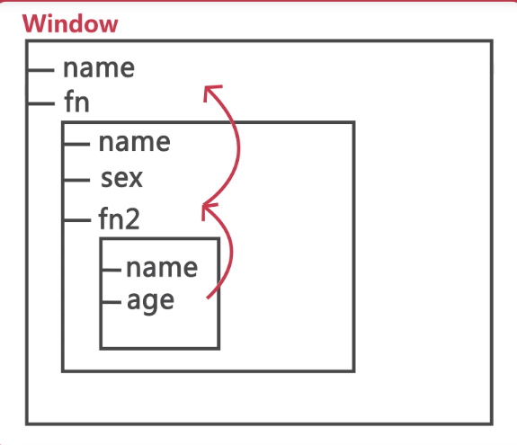
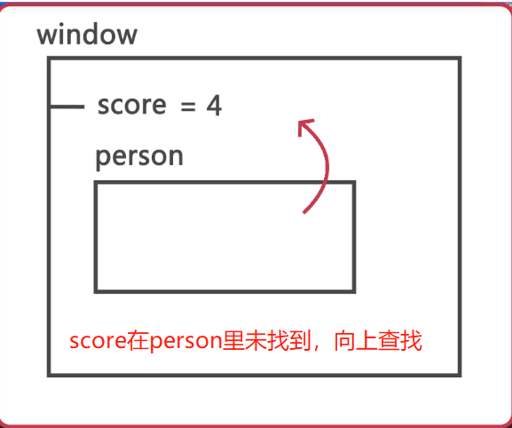

### 变量的作用域

> 变量起作用的区域(执行环境)，变量的生命周期和访问

#### 1. 全局作用域与局部作用域

```
var name = "xm"; //全局变量
function fn(argument){
  var sex = "female"; //局部变量
}
//e.g. 1
function fn() {
  var x = y =1;
}
fn();
console.log(x);
console.log(y);
//undefined, 1 因为不用var声明的变量是全局变量，y是全局变量，可以输出；x是局部变量，因此输出x会报错。

//js没有块级作用域
if(true){
  var name = "xm";
}
for(var i = 0;){

}
console.log(i);
// undefined
```

#### 2. 变量对象和作用域链
##### 1) 变量对象
```
var name = 'xm';
function fn(arguement){
  var sex = 'male';
  function fn2(arguement){
    var age = 28;
    //fn2.age
  }
  //fn.sex
  //fn.fn2
}
// name =========>   window.name
// fn =========> window.fn
```
##### 2) 作用域链
```
var name = "xm";
function fn(){
  var name = "xh";
  var sex = "male";
  function fn2(){
    var name = "xhei";
    var age = 18;
  }
}
```

###### 延长作用域链
```
var person = {};
person.name = 'xm';
person.sex = 'male';
var score = 4;
console.log(person.name);
console.log(person.sex);
console.log(score);
//不建议使用with, 且延长作用域链会降低查询速度。
with(person){
  name = 'xh';
  sex = 'famale';
  score = 44;
}
console.log(person.name);
console.log(person.sex);
console.log(score);
//xh female 44
```


###### 弹框案例
[案例地址](demoPage/demo1.html)