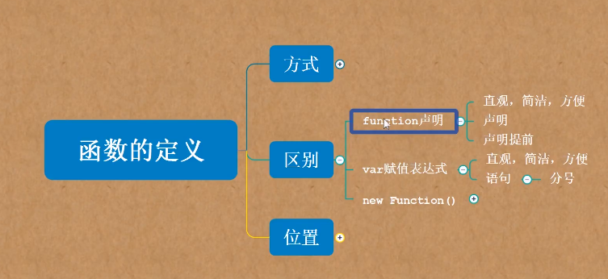
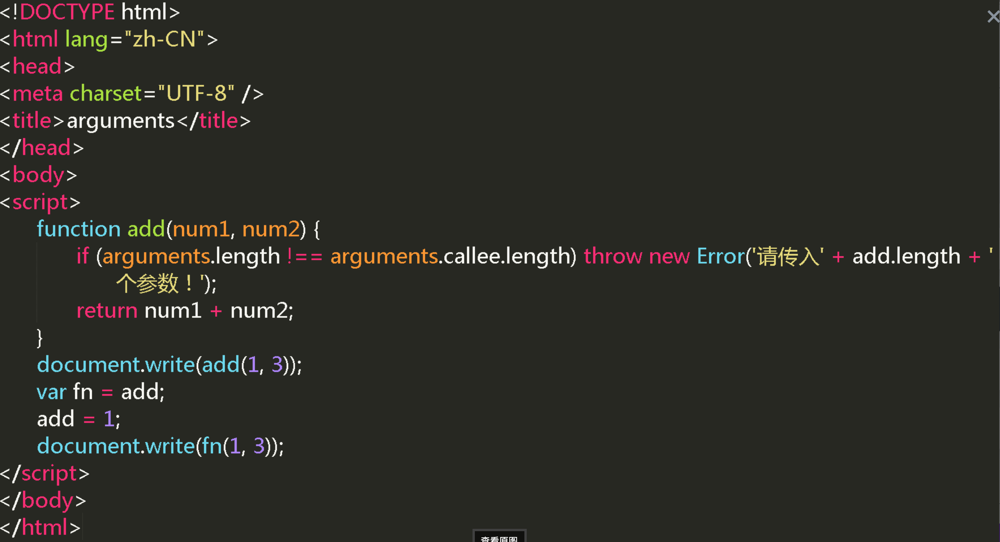

### 面向对象

#### 对象：值的集合/键值对

##### 对象的创建

```
//1.字面量创建
var xx = {}
//写入键值对
//2. 用构造函数创建
var cat = new Object();
//3.  ES5
Object.create();
```

##### 1. 对象属性的访问、赋值、删除

###### 1) xxx.xxx

###### 2) xxx["xxx"]

###### 3) delete xxx.xxx

##### 2. 对象中是否有某一属性 in

###### "xxx" in xxx

##### 3. 枚举 for in

###### for(var key in xxx) {console.log(key);console.log(xxx[key])}

---

### 什么是函数

> 一次封装，多处调用

```
function add(num1, num2){
  return num1+num2;
}
add(1,2);
```

---

### 三种函数定义方式及区别

```
//  字面量定义方式
// 1) function声明 - 推荐使用
function fn(){

}
fn();
// 2) var赋值表达式 - 可以使用，注意声明提前的问题
var fn = function(){

}
fn();
var fn = function fn2(){
  fn2();
}
fn();
fn2();// 错误，fn2作为局部变量在函数体内


// 构造函数定义方式 - 很少使用
// 3) 参数和函数体写在‘’内
var add = new Function('num1', 'num2','return num1+num2;');
add();

```

---

### 函数定义的位置

#### 全局作用域

```
add();
function add() {
  add()
}
add()
function sub(){
  add()
}
```

#### 函数作用域

```
//1. 全局中
fn();  //无法访问
function add(){
  fn();
  function fn(){
    fn();
    fn2();
    fn3(){
      fn();
    }
  }
  function fn2(){
    fn();
    fn3();
  }
}
fn(); // 无法访问

// 2. if/for 中 - 不建议
if(true){
  function add(){}
}else {
  function sub(){}
}
//预解析后都有声明
if(true){
  var add = function add(){}
}else {
  var sub = function sub(){}
}
// 预解析后未声明

// 3. 对象中
var person = {
  name: 'xm',
  setSex: function(sex){
    this.sex = sex;
  }
};
person.setName = function(name){
  this.name = name;
}
//调用：
person.setSex("male");

```



---

### 函数的调用

#### 1. 普通函数的调用

##### 命名函数/匿名函数

```
//命名函数
add();
//匿名函数
// 1.赋值给变量调用
var add = function(){}
add();
// 2.直接调用
function(){}(); // error  此语句仅声明，未调用
var add = function(){}(); // 不用function打头便可执行

(function(){})(); //匿名函数自执行
(function(){}()); //与上行基本一致

!+~function(){}(); // 加一元运算符

console.log(function(){}());

//递归调用
//递归 - 在函数内部调用函数本身
function factorial(num){
  if(num <= 1) return 1;
  return num * factorial(num-1);
}
console.log(factorial(5))

```

#### 2. 方法的调用

```
//a. 通过对象调用
var operation = {
  add: function(num1, num2){
    return num1 + num2;
  },
  sub: function(num1, num2){
    return num1 - num2;
  }
}

operation.add(1,1);

//b. 方法调用
document.onclick = function(){
  console.log("你点击了文档");
}
document.onclick(); // 模拟点击

//c. 对象里的属性引号问题
// 合法的标识符，加或不加都可以。
// 不合法的标识符，需要加'',用['']调用
// console.log(operation['@'](1, 2));


//d. 方法的链式调用- JQ
$('p').html("段落").css().......
var n = $('p');
var operation = {
  add: function(num1, num2){
    return num1 + num2;
    return this;
  },
  sub: function(num1, num2){
    return num1 - num2;
    return this;
  }
}
console.log(operation.add(1, 2).sub(2, 1));

```

#### 3. 构造函数的调用

```
function add(){

}

function Person(){

}

add(); //普通函数调用
new Person(); //构造函数调用，通过new，返回对象
Person(); //仍然是普通函数调用

Object();
new Object();
Array();
new Array();
```

#### 4. 间接调用

```
function add(){

}
add(); //直接调用
// 间接调用：
add.call
add.apply

var name = 'xm';
var person = {};
person.name = 'xh';
person.getName = function(){
  return this.name;
}
console.log(person.getName()); //直接调用 xh
console.log(person.getName.call(window)); //间接调用 window.name xm
console.log(person.getName.reply(window)); //间接调用 window.name xm

function add(num1, num2){
  return num1 + num2;
}
var datas = [1, 2];
console.log(add.call(window, 1, 2));
console.log(add.apply(window, [1, 2]));
console.log(add.apply(window, datas));

// call和apply第一个参数改变this的指向
//可以在继承中使用call 和 apply
//可以帮助数据是什么类型
```

---

### 参数的使用

#### 1. 参数的类型

```
function add(num1, num2){
  //num1,num2为形参，可当做var声明的局部变量，会进行预解析
  return num1 + num2;
}
add(1,2);
//1 2 为实参，替换形参，进行计算
//参数传递的本质，将实参赋值给形参

var person = {};
function setPerson(obj){
  obj.name = 'xm';
}
setPerson(person);

```

#### 2. 参数的个数

```
function add(num1, num2){
  return num1 + num2;
}
//1. 实参 = 形参
add(1,2); //3
//2. 实参 < 形参  可选参数
add(1); // num1 = 1; num2 = undefined;
function pow(base, power){
  //if(!power) power = 2;
  power = power || 2;
  return Math.pow(base, power);
}
console.log(pow(3));
console.log(pow(3,3));

//3. 实参> 形参
function add(){
  if(arguments.length === 0) return;
  var sum = 0;
  for(var i = 0; i < arguments.length; i ++ ){
    sum += arguments[i];
  }
  return sum;
}
add(1,2);
add(1,2,3);
add(1,2,3,4);
```

#### 3. arguments

[取最小值 demo](demoPage/demo2.html)

##### 类数组 - 类似数组的对象

##### 每个函数独有

##### arguments.callee 指函数本身，用在递归中

```
function factorial(num){
  if(num <= 1) return 1;
  return num * arguments.callee(num-1);
}
//严格模式下
"use strict";
//使用arguments.callee 报错, 这时候可以使用变量赋值，factorial名称可更改
var factorial = function fn(num){
  if(num <= 1) return 1;
  return num * fn(num-1);
}
console.log(factorial(5))
```

##### 判断形参和实参个数相等

```
function add(num1, num2){
if(arguments.length != add.length) throw new Error("请传入"+ add.length+"个参数！");
return num1 + num2;
}
```

###### 例题



> 答案：4,4
> 分析：fn 是一个函数，代码中把 add 赋值给了 fn，并且是在 add 值改变之前进行赋值的，所以 fn 还是 add 函数。调用 add 和调用 fn 输出的结果一样，都是 4。

##### 什么做参数

###### 没有/基本类型-数字，字符串，布尔值，undefined，null/引用类型-数组，对象，函数（回调）

---

### 函数的返回值

#### 1. return

##### 函数中使用，表示函数返回值

#### 2. continue

##### 循环中使用，表示跳出本次循环，继续下次循环

#### 3. break

##### 循环中使用，表示跳出当前循环，执行循环外语句

#### 4. 什么可以做返回值

##### 没有- undefined/基本类型-数字，字符串，布尔值，undefined，null/引用类型-数组，对象，函数（回调）

---

### 计算器案例

[案例-计算器](demoPage/calculator.html)