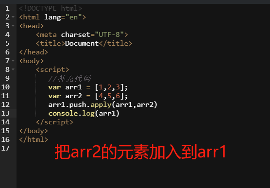

### 概述

#### 对代码的一种抽象，对外提供调用接口的编程思想

#### 几个名词：属性，方法，对象，原型

#### js 中的闭包

闭包：闭包是一个拥有许多变量和绑定了这些变量的环境的表达式（通常是一个函数）

```
function fn(){
  var n = 999;
}
fn();
alert(n);  // n 没有被定义
// 如何在作用域外部访问到n js ----> 在fn里面再定义一个函数

function fn1(){
  var n = 1;
  function fn2(){
    alert(++n);
  }
  return fn2;
}
var c = fn1();
c();
```

闭包用途： 1.读取函数内部变量 2.让 i 变量的值保留在内存中

闭包的优缺点：
优点：有利于封装；可以访问局部变量
缺点：i 一直在内存中，内存占用严重，容易产生内存泄露

#### 原型和原型链

```
var Person = function(){}
var p = new Person();
//三个阶段：
//1. var p = {}
//2. p.__proto__ = Person.prototype __proto__是自带的属性
//3. 创建对象（初始化对象）p
```

##### 原型继承与构造函数继承

[案例-继承](demoPage/继承.html)

---

#### JS 面向对象的关键词

> instanceof, delete, call, apply, arguments, callee, this

##### 1. instanceof

判断变量是否是对象的实例

##### 2. delete

用来删除对象属性
delete obj.name

1. 可以删除对象中的属性和方法
2. 不可以删除变量
   var a = 'aaa';
   delete a //无效
3. 不可以删除原型链上的属性和方法

##### 3. call, apply, arguments, callee

1. call 和 apply

```
function add(a, b){
  alert(a+b)
}
function subs(a,b){
  alert(a-b)
}
add.call(subs,5,3);
add.apply(subs,[5,3]);

//subs--> add ====> add(5,3) subs只能引用一个存在的对象，引用之后不是调用subs本身，而是用add替换掉


function Animal(){
  this.name = 'ani';
  this.showName = function(){
    alert(this.name);
  }
}
function Cat(){
  this.name = 'cat'
}
var an = new Animal();
var c = new Cat();
an.showName.call(c, ','); //通过call方法，将an里面的showName方法给 Cat 使用了
an.showName.apply(c, []); //通过apply方法，将an里面的showName方法给 Cat 使用了
```



2. callee

callee 是 arguments 的一个属性

callee：返回正在执行的 function 对象，function 内容
arguments.callee 默认值是正在执行的 function 对象 \*\*\*\* 谁执行指代谁

```
function demo(){
  alert(arguments.callee);// callee当做属性内容，弹出函数本身
  alert(arguments.callee()); //报错，死循环
}
demo();
//代替递归
var sum = function(n){
  if(n<=1){
    return 1;
  }else {
    // return n+sum(n-1);
    return n+arguments.callee(n-1); // 在函数内部调用本函数，一定要有终止条件
  }
}
alert(sum(5));
```

3. arguments

每个函数都有一个 Arguments 对象的实例 arguments,引用函数的参数（实参），可以用数组下标的方式引用 arguments 元素

arguments.length, 参数个数
arguments.callee 引用函数自身

```
function test(a,b,c){
  alert(argument.length); //3
  alert(arguments[0]); //1 arguments如果表示是参数，是可以被遍历的
}

test(1,2,3);
```

##### 4. this

常用情况：

1. this 函数调用

```
function test(){
  this.x =1; //this全局变量 global ==> x =1
  alert(this.x);
}
test();
等价于：
var x =1;
function test(){
  this.x = 0
}
test();
alert(x)
```

2. 作为方法调用 --> 构造函数内 this 指当前对象

```
function test(){
  this.name ="xm"; //指代当前对象
  this.age = 18;
}
var t = new test();
alert(t.name)
```

2. 在call 和apply 内， this指向第一个参数

```
var x = 0;
function test(){
  alert(this.x)
}
var o = {}
o.x = 1;
o.m = test;
o.m.apply(); //0
o.m.apply(o); //1
```


#### 对象冒充

```
function Person(name, age){
  this.name =name;
  this.age = age;
  function sayHi = function(){
    alert("hi");
  }
}
Person.prototype.walk = function(){
  alert("walk........")
}
function Student(name, age,grade){
  this.newMethod = Person; //冒充Person对象，传递特权属性和特权方法给子类
  this.newMethod(name,age);
  this.grade = grade;
}
var s1 = new Student("zs",15,5); // s1 是Student 对象，继承Person, 拥有Person所有属性和方法
alert(s1.name); //zs
alert(s1.age); //15
alert(s1.grade); // 5
s1.sayHi(); // hi
s1.walk(); // undefined is not a function
// walk 属于person的prototype对象，不属于person对象
//s1只继承person内的特权属性和特权方法，不继承共有方法和属性